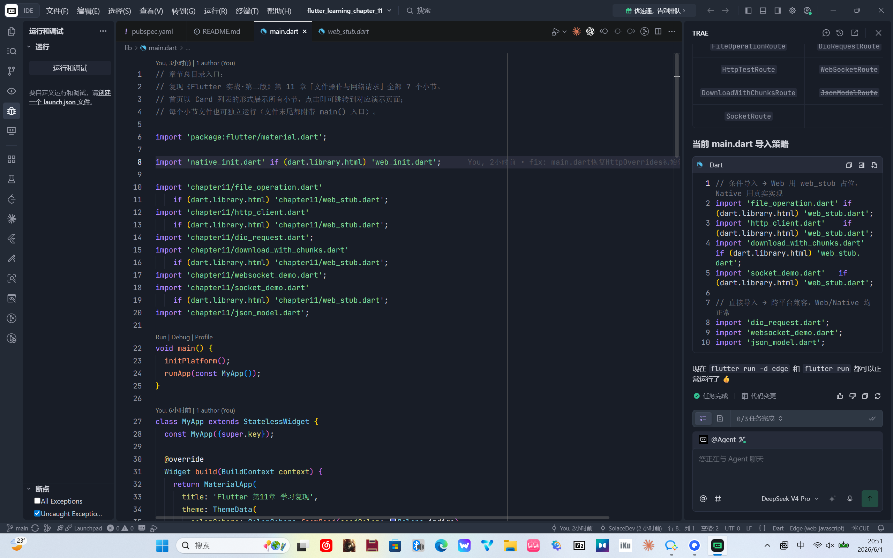
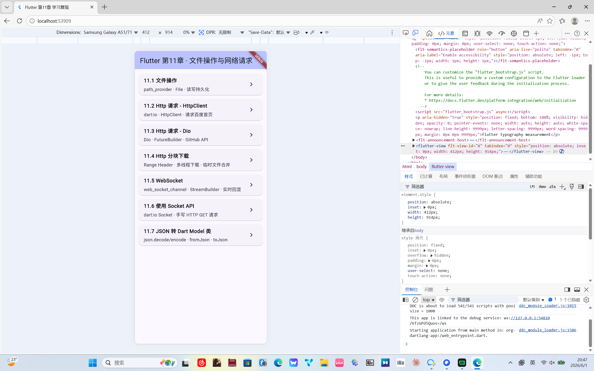

# Flutter 文件操作与网络请求

> 基于 [《Flutter 实战·第二版》第十一章](https://book.flutterchina.club/chapter11/) 的学习复现项目，完整覆盖文件持久化、HttpClient、Dio、分块下载、WebSocket、Socket API、JSON 序列化等核心机制。

## 环境信息

| 项目 | 版本 |
|------|------|
| Flutter | 3.41.4 |
| Dart | 3.11.1 |
| 主要依赖 | `path_provider`, `dio`, `web_socket_channel` |
| 支持平台 | Android / iOS / Web / Windows / macOS / Linux |

## 快速开始

```bash
git clone https://github.com/connonfisher/flutter_learning_chapter_11.git
cd flutter_learning_chapter_11
flutter pub get
flutter run
```

## 项目结构

```
lib/
├── main.dart                          # 章节目录导航页
└── chapter11/
    ├── file_operation.dart            # 11.1 文件操作
    ├── http_client.dart               # 11.2 Http请求-HttpClient
    ├── dio_request.dart               # 11.3 Http请求-Dio
    ├── download_with_chunks.dart      # 11.4 实例：Http分块下载
    ├── websocket_demo.dart            # 11.5 WebSocket
    ├── socket_demo.dart               # 11.6 使用Socket API
    └── json_model.dart                # 11.7 JSON转Dart Model类
```

每个小节文件均可独立运行（含 `main()` 入口），也可从首页目录导航进入。

## 目录导航主页

`main.dart` 提供章节总览入口，7 张卡片列出全部小节，点击即可导航进入对应页面。

| 代码截图 | 运行效果 |
|---------|---------|
|  |  |

### 核心实现

```dart
class HomePage extends StatelessWidget {
  const HomePage({super.key});

  static final List<_SectionItem> _sections = [
    _SectionItem('11.1 文件操作', 'path_provider · File · 读写持久化',
        (_) => const FileOperationRoute()),
    _SectionItem('11.2 Http 请求 - HttpClient', 'dart:io · HttpClient · 请求百度首页',
        (_) => const HttpTestRoute()),
    // ... 共 7 个小节
  ];

  @override
  Widget build(BuildContext context) {
    return Scaffold(
      appBar: AppBar(title: const Text('Flutter 第11章 · 文件操作与网络请求')),
      body: ListView.builder(
        padding: const EdgeInsets.symmetric(vertical: 8),
        itemCount: _sections.length,
        itemBuilder: (context, index) {
          final item = _sections[index];
          return Card(
            margin: const EdgeInsets.symmetric(horizontal: 12, vertical: 6),
            child: ListTile(
              title: Text(item.title, style: const TextStyle(fontWeight: FontWeight.bold)),
              subtitle: Padding(
                padding: const EdgeInsets.only(top: 4),
                child: Text(item.subtitle),
              ),
              trailing: const Icon(Icons.chevron_right),
              onTap: () => Navigator.push(
                context,
                MaterialPageRoute(builder: item.builder),
              ),
            ),
          );
        },
      ),
    );
  }
}
```

---

## 11.1 文件操作

> 原文链接：[https://book.flutterchina.club/chapter11/file_operation.html](https://book.flutterchina.club/chapter11/file_operation.html)

### 功能介绍

| 知识点 | 说明 |
|--------|------|
| `path_provider` | 获取应用沙盒目录（文档目录、临时目录、外部存储） |
| `dart:io` File | 文件读写：`readAsString()` / `writeAsString()` |
| `getApplicationDocumentsDirectory()` | 获取只有本应用可访问的持久化目录 |
| 计数器持久化 | 点击次数写入 `counter.txt`，重启后可恢复 |

### 演示效果

| 代码截图 | 运行效果 |
|---------|---------|
|  |  |

### 核心代码示例

**获取文件路径 & 读取内容**

```dart
Future<File> _getLocalFile() async {
  String dir = (await getApplicationDocumentsDirectory()).path;
  return File('$dir/counter.txt');
}

Future<int> _readCounter() async {
  try {
    File file = await _getLocalFile();
    String contents = await file.readAsString();
    return int.parse(contents);
  } on FileSystemException {
    return 0;
  }
}
```

**写入文件（持久化计数）**

```dart
Future<void> _incrementCounter() async {
  setState(() { _counter++; });
  await (await _getLocalFile()).writeAsString('$_counter');
}
```

### 独立运行

```bash
flutter run -t lib/chapter11/file_operation.dart
```
